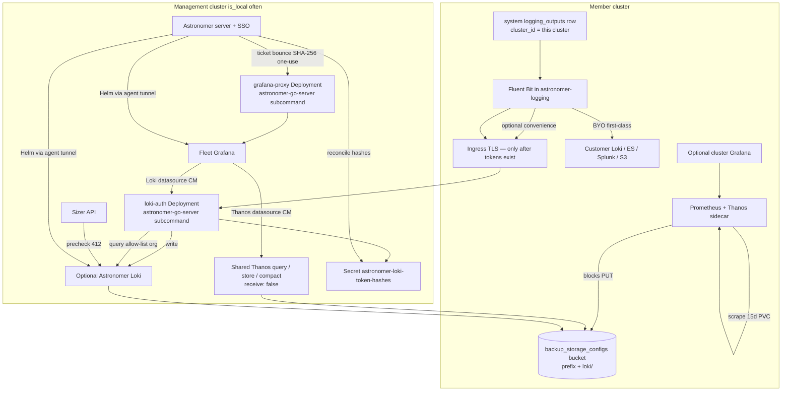

# Astronomer-hosted fleet observability: Grafana UI + optional Loki, sitting next to existing Thanos

| Field | Value |
| --- | --- |
| Status | Implemented (revision 6 + deferred follow-ups) |
| Date | 2026-08-19 |
| Author | TBD |
| Codebase | `/root/astronomer-all/astronomer` (branch `ui/kit-cleanup`) |
| Live install | k3s at `astronomer.dev.alphabravo.io` — the management plane often *is* a small local cluster (`is_local=true`) |
| Related | Shared stacks (`frontend/src/components/monitoring/shared-stacks-page.tsx`), `sharedStackLifecycle` (`internal/handler/monitoring_stack_shared.go`), logging destinations/pipelines (`internal/handler/logging.go`) |

---

## Overview

Astronomer already runs a **shared Thanos** stack as the fleet metrics warehouse and a **per-cluster kube-prometheus-stack** that optionally ships blocks to that warehouse via a Thanos sidecar. Operators send logs to **BYO destinations** (Loki, Elasticsearch, Splunk, CloudWatch, Datadog, S3, syslog) through Fluent Bit pipelines. There is no fleet Grafana and no hosted log warehouse.

This design adds two complementary pieces next to Thanos, not instead of it:

1. **Fleet Grafana** on the management cluster — a cheap UI/lobby whose datasources are shared Thanos (metrics) and whatever log backend is configured (hosted Loki if present, else BYO Loki).
2. **Optional Astronomer Loki** — a convenience log warehouse installed only when a **sizer** says the management cluster can absorb ingest **and** a backup-storage (object-store) config exists. Each member cluster that opts in gets its **own** system `logging_outputs` row pre-filled as "Astronomer logs"; BYO sinks stay first-class.

Grafana is always-safe. Loki is maybe-safe and fail-closed. Thanos receive stays off. If Astronomer is down, cluster Prometheus continues; hosted log shipping fails (acceptable for convenience, not for compliance).

v1 isolation for a project- or cluster-scoped viewer is **Explore-lock on `grafana-proxy` (403 `GET /explore*` only)** plus **`loki-auth` allow-list org selection**. Thanos is **not** a tenant security boundary in v1 (`var-cluster` is UX; PromQL rewrite is PR 9). It is not Grafana Enterprise LBAC, not a per-role `grafana.ini` knob, and not a spoofable `X-Dashboard-Uid` gate.

---

## Background & Motivation

### Current state (verified in code)

**Shared monitoring stacks** live under Observability → Shared stacks (`/dashboard/settings/monitoring`). Two families are driven by one `sharedStackLifecycle[Req]` driver in `internal/handler/monitoring_stack_shared.go`:

| Family | Chart | Default release | Object storage | Lifecycle verbs |
| --- | --- | --- | --- | --- |
| Shared Thanos | `thanos` @ `https://stevehipwell.github.io/helm-charts/` `1.23.0` | `thanos` in `monitoring` | **required** (`storageConfigId` → `GetBackupStorageConfigByID`) | `monitoring:update` global for install/upgrade/replace/uninstall |
| Shared Alertmanager | `alertmanager` @ `https://prometheus-community.github.io/helm-charts` `1.18.0` | `astronomer-alertmanager` | none (2Gi PVC) | same |

The driver comment says a new family gets all six authz gates free because the preamble is written once. Grafana and Loki are **shared families 3 and 4** (not a seventh — Thanos and Alertmanager already exist). They are not a new subsystem.

The six lifecycle methods have **no per-family conditionals**. A Loki 412 sizer gate therefore needs a generic `precheck` hook on the driver (see API), not a forked `install`.

Thanos values already pin `"receive": {"enabled": false}` (`sharedThanosPayload`). Metrics enter the warehouse **only** as sidecar-uploaded blocks. This design does not open a receive API.

**Per-cluster kube-prometheus-stack** (`internal/handler/monitoring_stack_cluster.go`, chart `61.3.2`):

- Local Prometheus retention default `15d`, storage `50Gi` / class `default`.
- `enableGrafana` / `enableAlertmanager` default **true** when omitted (`*bool` chart-default).
- Thanos sidecar default on; object storage optional via the same `storageConfigId`.
- `prometheusSpec.externalLabels` always set `{cluster_id: <cluster UUID>}` unless the operator overrides the label name/value.
- Replace-required (HTTP 409) on namespace, release name, object-storage mode/id/secret, storage class, storage size.

**Logging** is a separate controller (`internal/handler/logging.go`):

- Destinations (`logging_outputs`) and pipelines (`logging_pipelines`) enqueue `logging_operations`; a 30s reconciler renders Fluent Bit **ConfigMaps only** into `astronomer-logging` on the member cluster. It does not own the Fluent Bit DaemonSet and cannot add volume mounts.
- `enqueueOutputApply` returns `"logging output has no cluster_id"` when `ClusterID` is invalid. `renderFullFluentbitConfig` loads `ListOutputsByCluster`. A NULL or management-cluster-only row is never rendered onto members.
- `logging_outputs.cluster_id` is an FK with `ON DELETE CASCADE`.
- `logging_pipeline_outputs` exists in SQL (`001_initial.up.sql`) but has **no sqlc queries and no handler**. `renderPipelineBlock` emits `[FILTER]` only. Every enabled per-cluster output is mounted independently. There is no join to "link" a pipeline to an output today.
- Output types: `elasticsearch`, `loki`, `splunk`, `cloudwatch`, `datadog`, `s3`, `syslog` (plus `stdout` in the renderer). Frontend type: `LoggingOutputType` in `frontend/src/types/index.ts`.
- Loki output already renders `Host`/`Port`/`Labels`/`tenant_id` (no bearer). It is the only queryable backend (`POST /api/v1/logging/outputs/{id}/query/` → `queryLokiOutput` in `logging_loki_query.go`), and that client uses `httpclient.SafeClient`, which **refuses private/loopback** targets.
- Authz is **per-cluster** `rbac.ResourceLogging` (create/update/delete/read). Fleet-wide list filters in-process.
- `logging_outputs.configuration` is **plaintext JSONB**. List/get return the blob. Tokens (Splunk HEC, Datadog API key) are not Fernet-sealed today.

**Management-plane Fluent Bit** (`deploy/chart/values.yaml` `managementLogging`, default `enabled: false`) ships *Astronomer server/worker* logs, not member clusters. Distinct problem; out of scope except as a later consumer of hosted Loki.

**Grafana already appears in three other places**, none of which is a fleet lobby:

- Per-cluster kube-prom Grafana (`grafana.enabled`).
- Dashboard ConfigMaps for the kube-prom sidecar (`deploy/chart/templates/dashboards-configmap.yaml`, eight JSON files under `deploy/dashboards/`, gated on `metrics.dashboards.enabled` default **false**).
- `grafana_panel` dashboard widgets (`internal/handler/dashboards.go`) — sandboxed iframes allow-listed by `dashboard.allowed_iframe_hosts` (empty = block all).

**Object storage** is `backup_storage_configs`, decrypted via `auth.Encryptor` (`objectStoreSecretSpec` / `storageCredentials` in `internal/handler/monitoring.go`). `buildObjstoreConfigYAML` emits Thanos `type: S3` with `config.bucket/endpoint/access_key/secret_key` and optional `prefix` from `backup_storage_configs.prefix`. Loki must reuse the same id via a **different** YAML shape, not that file. No third bucket system.

**Feature flags.** `feature.monitoring` defaults **true** (`internal/handler/platform_settings.go`). `FeatureGate` hard-codes fallback **true**; new opt-in flags must use `FeatureGateDefault(..., false)` (same comment as `feature.extensions` / `feature.charlie`). `/api/v1/settings/monitoring/*` is **not** wrapped in `feature.monitoring` today (`routes.go`); only the SPA hides it. There is no `feature.logging` flag; the Logging nav item is always on, gated only by `logging:read`. Sidebar `optIn` only hides a **nav item**; Grafana/Loki will be extra panels on Shared stacks, not new nav rows.

**RBAC gap:** among *named* templates, only `logging-viewer` grants `logging` (`read, list`). `cluster-operator` has `monitoring` but **not** `logging`. Wildcard roles `cluster-owner` and `platform-admin` (`*`/`*`) and superuser also grant it. One-click log shipping 403s for `cluster-operator` until that template (and a bind-time note) is updated.

**Official v1.0.0 pins** (agent image digest, Flux distribution certificate identity) are immutable on the live install. This design must not retag them. Chart-side UI images may keep `digest: ""`; production still requires `agent_image_repository` digest-pinned (`internal/config/production.go`).

**clustermetrics today** (`internal/handler/clustermetrics/cache.go` `collectLocal` / `collectRemote`): node allocatable + metrics-server usage + `Pods("").List(Limit: 500)` for **count only**. It does not sum `resources.requests`, does not record `Continue`/truncation, does not filter Ready/non-unschedulable, and does not inspect StorageClass access modes. The sizer needs **new collectors**; it cannot "compose" the existing snapshot as-is. No new agent protocol (official pin stays).

**`grafanaUrl`** does not exist on the default monitoring backend today. Thanos persists `QueryUrl` via `defaultSharedThanosQueryURL` (`http://<release>-query-frontend.<ns>.svc.cluster.local:9090`). Adding `grafanaUrl` is new.

### Pain points

- Fleet metrics in Astronomer are a cluster-picker (`frontend/src/routes/dashboard/monitoring/index.tsx`) that bounces into per-cluster Prometheus queries. There is no cross-cluster Grafana, no long-term explore UI, no log correlated with those metrics.
- Operators who want logs already wire BYO Loki/ES/Splunk. A hosted convenience sink would collapse a common setup — but only if it cannot OOM the management plane.
- Opening Thanos receive or Loki ingest on a 4-core k3s that *is* the product is a class of outage we have already agreed to refuse.

---

## Goals & Non-Goals

### Goals

- Fleet Grafana as a Shared-stack family, datasources = Thanos query + configured log backend.
- Optional Astronomer Loki as a Shared-stack family, identical lifecycle shape, **sizer + object storage** hard gates.
- Built-in "Astronomer logs" destination as **one system `logging_outputs` row per member cluster**; cluster-side one-click upserts that row and enables it. BYO destinations remain first-class.
- Enforce `cluster` (and later `project` / `namespace`) labels at ingest, not as a dashboard filter.
- Map Astronomer SSO/RBAC into Grafana so a cluster- or project-scoped viewer cannot **Explore** another tenant in v1 (`GET /explore*` 403) and cannot query another Loki org (`loki-auth`). Thanos series isolation is **not** a v1 security boundary.
- Explicit two-Grafana story.
- Fail-closed ingest caps on Loki (reject/shed, not a banner).
- Incremental PRs; each independently reviewable. Loki Ingress is not public until tokens exist.

### Non-Goals

- Replacing Thanos with Grafana Mimir, or Grafana with anything else.
- Enabling Thanos Receive / a metrics write API.
- Compliance-grade hosted logging (WORM, legal hold, customer-managed keys beyond the existing backup-storage encryptor, multi-region).
- A dedicated observability node pool. If the management cluster is too small, we refuse Loki and tell the operator to BYO. Node-pool topology is a later design.
- Installing Fluent Bit itself (still "assumed present" in `astronomer-logging`, as today's controller).
- Changing official agent/Flux v1.0.0 identity pins, or introducing a Grafana Operator CRD platform.
- Hosting Elasticsearch, Splunk, or a second metrics TSDB.
- Auto-shipping management-plane (`managementLogging`) logs into Astronomer Loki in v1 of this work (easy follow-up once Loki exists).
- Implementing `logging_pipeline_outputs` in v1 (the join is unused; attach does not need it).
- Grafana Enterprise LBAC, PromQL/LogQL rewrite, and folder-per-cluster RBAC in v1 (follow-up PRs).
- Patching the Fluent Bit DaemonSet / Helm `extraVolumes` in v1.

---

## Key Decisions

1. **Grafana and Loki are new `sharedStackLifecycle` families (shared families 3 and 4), not a new product surface.** Rationale: the driver exists so a new family cannot skip authz; UI is one `StackLifecyclePanel`; operations queue already understands `target_type`. Inventing a parallel Helm path would fork 409-replace, drift, and audit. Sizer 412 is a generic `precheck` hook, not a forked `install`.

2. **Thanos Receive stays disabled.** Rationale: object-storage-only sidecars are the safer write path already in `sharedThanosPayload`. Loki ingest *does* open a write path; we accept that cost once, for logs, behind tokens + caps. We do not open a second write path for metrics.

3. **Grafana default: opt-in install, recommended when Thanos is healthy. Loki default: off.** Rationale: Grafana is cheap (250m/256Mi) and high leverage; still not auto-installed because the management cluster is often local k3s. Loki is gated by sizer and object storage and must never default-on. `feature.hosted_loki` is `FeatureGateDefault(..., false)` on the **API**, not only the SPA.

4. **Grafana auth = ticket bounce onto a dedicated `grafana.<platform-host>`, not a widened `astronomer_session` Domain, not Grafana SSO, not a shared password, not a subpath.** Rationale: `setBrowserSessionCookies` (`internal/handler/auth.go`) sets `astronomer_session` with **no `Domain`**. Widening `Domain` would leak the session to every sibling subdomain. The mint/redeem hops are specified below: a **dedicated** Grafana ticket store on the Astronomer server (do **not** overload `StreamTicketStore` kinds `{events,registration,logs,exec,shell}` — those require `clusterID` and `NormalizeStreamKind`). `grafana-proxy` redeems via HTTP to the server and **never** mounts Redis or `ASTRONOMER_SECRET_KEY`. `grafana_auth` is HMAC/JWT with a **Grafana-family Secret**, not the platform JWT key. `?return=` is allow-listed to `https://<grafanaHost>/` (or `/auth/callback`). Ticket and `return` are not logged. The proxy is an `astronomer-go-server grafana-proxy` Deployment in the Grafana family. Default host = `grafana.` + hostname of `config.ServerURL` or `gateway.hosts[0]` — **never** `values.ingress.host`. Grafana Service stays ClusterIP.

5. **Loki tenant id = cluster UUID (`X-Scope-OrgID`), with `cluster` / `namespace` / `pod` labels enforced at Fluent Bit.** Rationale: Loki's native multi-tenancy is the isolation boundary. Dashboard variables are not a security control.

6. **Built-in destination is one system `logging_outputs` row per member cluster (`output_type=loki`, `is_system=true`, `cluster_id` set), not a fleet-wide row and not a new type.** Rationale: the controller requires `cluster_id`, renders `ListOutputsByCluster`, and cascades on cluster delete. Unique `(cluster_id) WHERE is_system`. Attach = upsert that row + enable + refresh aggregate Fluent Bit config. No `logging_pipeline_outputs`.

7. **Fleet Grafana does not auto-disable per-cluster Grafana.** Rationale: cluster Grafana talks to *this* Prometheus (15d, works if Astronomer is down). Changing omitted `enableGrafana` from true → false when fleet Grafana is healthy is a **changelog'd behavior change** in its own PR, not silent UX.

8. **Sizer is fail-closed for Loki, leftover-floor for Grafana.** Rationale: Grafana cannot OOM the plane at 256Mi. Loki ingesters can. A warning banner is not a cap. Evaluation is a single first-match-wins procedure (below).

9. **Grafana is provisioning-first (sidecar ConfigMaps + optional small PVC); Loki uses TSDB + object storage from day one.** Rationale: stateless Grafana upgrades; skip boltdb-shipper. Loki (and later BYO) datasources are **sidecar-discovered ConfigMaps** (`grafana_datasource=1`) owned by the Loki family so Loki uninstall does not Helm-upgrade Grafana.

10. **Do not change agent/Flux official pins. Grafana/Loki images match shared Thanos: no registry rewrite in the Go payload; airgap operators mirror `grafana/grafana`, `grafana/loki`, and `nginx`.** Rationale: `astronomer.thirdPartyImage` is an Astronomer-chart Helm helper; `applySharedThanosStack` does not inject `image.registry` either. `loki-auth` reuses the `astronomer-go-server` image (subcommand), not a fourth pin identity.

11. **v1 query isolation = `grafana-proxy` 403s `GET /explore*` only; Loki isolation is `loki-auth` only; Thanos is not a tenant security boundary in v1.** Rationale: Grafana OSS `[explore] enabled` is a **global** flag. `X-Dashboard-Uid` is client-controlled (and Grafana 11.6 is not verified to send it on panel refresh). Gating `/api/ds/query` on that header either 403s every dashboard or lets a Viewer spoof a uid and run arbitrary PromQL against shared Thanos. v1 therefore: 403 `GET /explore*` for anyone who is not global `monitoring:update` / superuser; allow `POST /api/ds/query` (and dashboard GETs) for any `grafana_auth` that passed `monitoring:read`. Dashboard `var-cluster` is UX. PromQL rewrite remains PR 9. Loki stay isolated via the allow-list org-selection rule (Key Decision 5/query hop). Do not claim a per-role `grafana.ini` knob.

12. **Same `storageConfigId` as Thanos; Loki `s3.prefix = join(storageCfg.Prefix, "loki")` (or `loki` when prefix is empty).** Rationale: no third bucket system. Never write Thanos `objstore.yml` into Loki. Bucket lifecycle on the Thanos prefix does not expire Loki objects (and vice versa). Preview shows the computed prefix.

13. **`ingestHostname` is required and explicit on Loki install. Never derived from the Astronomer ingress host.** Rationale: no surprise DNS. Ingress is **not** created until ingest tokens exist; until then Loki gateway + `loki-auth` stay ClusterIP.

14. **Member-side ingest token is `bearer_token` in the Fluent Bit OUTPUT ConfigMap (accepted secret-policy exception for the member copy only).** Rationale: the logging reconciler only writes ConfigMaps; it cannot mount `bearer_token_file`. Postgres keeps `token_hash` + Fernet `token_encrypted` for re-render. List APIs never return the token.

15. **v1 sizer re-eval freezes new attaches only. Do not uniformly lower per-tenant rates just because estimated GiB/day crossed a line.** Ratchet Loki `limits_config` (enqueue an explicit upgrade `reason=sizer_ratchet`) only when leftover/usable drops below the **running mode floor**. No surprise-shed for already-attached clusters on estimate drift.

---

## Proposed Design

### Architecture



### Data / control flow for a log line

```mermaid
sequenceDiagram
  participant Pod as Workload pod
  participant FB as Fluent Bit
  participant Ing as Ingress (post-tokens)
  participant Auth as loki-auth
  participant Loki as Loki write
  participant S3 as Object storage
  participant G as grafana-proxy + Grafana
  participant Astro as Astronomer server
  participant U as Operator

  Pod->>FB: container logs
  FB->>FB: kubernetes filter + enforce labels cluster, namespace, pod, job
  FB->>Ing: POST /loki/api/v1/push<br/>Authorization: Bearer cluster-token<br/>X-Scope-OrgID: cluster-uuid
  Ing->>Auth: same
  Auth->>Auth: load hashes from Secret<br/>reject unknown token or org mismatch
  alt over cap or bad token
    Auth-->>FB: 401 or 429
  else admitted
    Auth->>Loki: X-Scope-OrgID bound from token
    Loki->>S3: TSDB shipper
  end
  U->>G: grafana.<platform-host> (no astronomer_session)
  G->>Astro: GET /grafana-ticket?return= allow-listed
  Astro->>G: 302 + ticket; proxy POST /grafana-ticket/redeem
  Note over G: grafana_auth HMAC with Grafana-family Secret
  G->>Auth: query + X-Grafana-User + X-Scope-OrgID from var-cluster
  Auth->>Auth: allow-list: use client org if in list;<br/>else sole tenant; else 400; 401 if outside list
  Auth->>Loki: query
  Note over G,U: GET /explore* 403 unless global monitoring:update; ds/query allowed
```

Metrics never traverse this write path. Sidecar → bucket → store-gateway remains the only metrics ingest.

### Component placement

| Component | Where | How installed | Namespace default | Default release |
| --- | --- | --- | --- | --- |
| Fleet Grafana | Management cluster (`managementClusterId`) | New shared family via `sharedStackLifecycle` | `monitoring` | `astronomer-grafana` |
| Astronomer Loki | Same management cluster | New shared family, sizer-gated | `monitoring` | `astronomer-loki` |
| `loki-auth` | Same namespace as Loki | Deployment in the Loki family values; image = `astronomer-go-server` | `monitoring` | part of Loki release |
| Loki ingest Ingress | Management cluster | **Not in the Loki install PR.** Created when tokens exist, host = required `ingestHostname` | `monitoring` | n/a |
| `grafana-proxy` | Management cluster | Deployment in the Grafana family; image = `astronomer-go-server` subcommand `grafana-proxy` | `monitoring` | part of Grafana release |
| Grafana Ingress/Gateway | `grafana.<platform-host>` (`ServerURL` / `gateway.hosts[0]`, never `values.ingress.host`) | **PR 3a only.** Backend = `grafana-proxy`. Grafana Service stays ClusterIP | `monitoring` | n/a |
| Per-cluster Prometheus | Member cluster | Existing cluster stack | `monitoring` | `prometheus` |
| Per-cluster Grafana | Member cluster | Existing `enableGrafana` | `monitoring` | n/a |
| Fluent Bit | Member cluster `astronomer-logging` | Assumed present (baseline catalog) | `astronomer-logging` | n/a |
| System destination | Postgres `logging_outputs` **one row per member cluster** | Upsert on attach / Loki healthy | n/a | n/a |

Shared Grafana/Loki Helm work goes through the existing `HelmRequester` / `monitoring_operations` reconciler (30s tick, immediate trigger, supersession, auto-rollback policy). `executeMonitoringOperation` must grow `shared_grafana` / `shared_loki` cases. No new worker type.

### Two Grafanas

| | Cluster Grafana | Fleet Grafana |
| --- | --- | --- |
| Purpose | Debug **this** environment | Compare clusters, long-term metrics, logs |
| Datasource | In-cluster Prometheus (15d) | Shared Thanos query-frontend + Loki/BYO |
| Availability if Astronomer is down | Works | Dead |
| Who installs | Cluster Monitoring Stack, `enableGrafana` | Shared stacks, monitoring admin |
| Auth | kube-prom default — unchanged in this design | Ticket bounce + `grafana-proxy` on `grafana.<platform-host>` |
| Recommendation when fleet Grafana is healthy | Leave installed for air-gapped debug. Copy on the cluster stack panel. | CTA from Fleet metrics **only after auth-proxy + Explore-lock** |

We do **not** uninstall cluster Grafana automatically. Forcing that would destroy the only metrics UI that survives an Astronomer outage.

Omitted `enableGrafana` staying **true** for new cluster stacks is the current handler behavior (`monitoringStackPayload`). Changing it when fleet Grafana is healthy is a documented behavior change in **PR 8**, not a silent default in the Grafana lifecycle PR.

### Tenancy model

**Ingest (enforced):**

- Metrics: keep `prometheusSpec.externalLabels[cluster_id]=<cluster UUID>` (`monitoringStackPayload`).
- Logs: Fluent Bit `Labels` **always** include `cluster="<uuid>"`. Additional `namespace`, `pod`, `container`, `job` from the kubernetes filter. The system destination renderer ignores operator-supplied `tenant_id` and sets `tenant_id` to the cluster UUID. `X-Scope-OrgID` on the wire is that UUID. `loki-auth` rejects pushes whose bearer is not bound to that org (client header cannot widen it).

**Query (v1):**

- Grafana org: one org `astronomer`. Not org-per-cluster.
- **Explore-lock is enforced on `grafana-proxy`, not in `grafana.ini`.** `[explore] enabled` is a global Grafana OSS flag — false would also kill Admin Explore. Do not claim a per-role ini knob. Do **not** gate `/api/ds/query` on `X-Dashboard-Uid` (client-controlled; Grafana 11.6 is not verified to send it on panel refresh).
  - Anyone who is **not** global `monitoring:update` / superuser: proxy **403 `GET /explore` and `GET /explore/*` only**.
  - `POST /api/ds/query` and dashboard HTML/JSON GET: **allowed** for any `grafana_auth` that passed `monitoring:read` at ticket mint. That means a Viewer **can** run PromQL against shared Thanos from a dashboard (or a crafted POST). **Thanos is not a tenant security boundary in v1.** `var-cluster` is UX. PromQL rewrite is PR 9.
  - Loki queries still go Grafana → `loki-auth`; isolation is the allow-list org-selection rule only.
  - Tests: Viewer `GET /explore` → 403; Viewer `POST /api/ds/query` → 200 (if `grafana_auth` valid); admin Explore → 200.
- Loki queries from Grafana go Grafana → `loki-auth` ClusterIP (`dataproxy.send_user_header=true` → `X-Grafana-User`). Org selection (every caller, including Viewers and admins):
  1. Map `X-Grafana-User` → allow-list of cluster UUIDs from ConfigMap `astronomer-loki-query-acl`.
  2. If client `X-Scope-OrgID` ∈ allow-list → **use it**.
  3. If header **missing** and allow-list length is **1** → use that tenant.
  4. If header **missing** and allow-list length ≠ 1 → **400**.
  5. If client org is **outside** the list → **401**.
  Provisioned dashboards set `X-Scope-OrgID` from `var-cluster`. That variable is not a security control; the allow-list is. OSS Loki still answers one tenant per request; fleet-wide Explore is one tenant at a time for admins.
- Thanos queries from Viewers in v1 are **not tenant-isolated**. Provisioned dashboards default `var-cluster` for UX. PromQL rewrite (`POST /api/ds/query`) is PR 9.
- Folder-per-cluster provisioning waits. v1 folders: `Fleet`, `Management plane`.
- Project-scoped LogQL `{namespace=~"..."}` waits.

**Why not Grafana org-per-tenant in v1:** org switching is a poor UX for fleet compare, and Thanos is a single query API without org IDs.

### Network path

#### Loki push (after tokens exist)

Hop-by-hop:

1. Fluent Bit on the member cluster → TLS Ingress host = operator-supplied `ingestHostname` (required). Path `/loki/api/v1/push`. Headers: `Authorization: Bearer <token>`, `X-Scope-OrgID: <cluster UUID>`.
2. Ingress → Service `astronomer-loki-auth` (name derived from Loki `releaseName` + `-auth`), **not** Loki's nginx gateway on the public path.
3. `loki-auth` (Astronomer server binary, subcommand `loki-auth`, **same `astronomer-go-server` image**):
   - Loads `astronomer-loki-token-hashes` Secret in-cluster (reconciled by Astronomer server via existing `K8sRequester` on the management cluster). No Postgres and no Astronomer API on the push path.
   - SHA-256 the bearer, look up hash → `cluster_id`.
   - If missing/unknown → 401.
   - If `X-Scope-OrgID` present and ≠ bound cluster UUID → 401.
   - Sets `X-Scope-OrgID` to the bound UUID (client cannot pick another org).
   - Applies in-process rate counters matching `limits_config` (defense in depth; Loki still 429s).
4. `loki-auth` → Loki write / nginx gateway **ClusterIP** (`http://<lokiRelease>-gateway.<ns>.svc.cluster.local`).
5. NetworkPolicy: Ingress → `loki-auth:8080`; `loki-auth` → Loki gateway; Loki write/read pods admit gateway + `loki-auth` + Grafana. Grafana does **not** talk to Loki write directly.

Until PR 5, step 1–2 do not exist. Loki gateway and `loki-auth` are ClusterIP-only. `ingestHostname` is stored on metadata but no Ingress object is applied. Status shows `ingestPublic: false`.

mTLS from member clusters is **not** required in v1.

#### Loki query

1. Grafana datasource `url` = `http://<lokiRelease>-auth.<ns>.svc.cluster.local:8080` (derived from persisted Loki metadata, never a hardcoded DNS name).
2. Grafana `grafana.ini` `dataproxy.send_user_header = true` (sends `X-Grafana-User`).
3. `loki-auth` query path (`/loki/api/v1/query`, `query_range`, `labels`, `series`, `tail`): map `X-Grafana-User` → allow-list from ConfigMap `astronomer-loki-query-acl`. Then:
   - client `X-Scope-OrgID` ∈ allow-list → use it;
   - header missing and `len(allow-list)==1` → use that;
   - header missing and `len≠1` → 400;
   - client org outside the list → 401.
4. Superuser / global `monitoring-admin`: allow-list = all cluster UUIDs (same selection rule; they must still send an org when they have more than one cluster).

#### Grafana access

**Key Decision 4 — dedicated host + ticket bounce.**

`astronomer_session` is **not** sent to `grafana.<host>`. `setBrowserSessionCookies` sets no `Domain` (`internal/handler/auth.go`). We do **not** widen it.

**Proxy process:** Grafana-family Deployment `grafana-proxy`, command `astronomer-go-server grafana-proxy` (same image as server / `loki-auth`). Grafana Service is ClusterIP. Ingress/Gateway (PR 3a) backend = proxy only; never the Grafana Service.

**Default host:** `grafana.` + hostname of `config.ServerURL`, falling back to `gateway.hosts[0]`. **Never** `values.ingress.host` (`ingress.enabled` defaults false; `ingress.host` defaults to `astronomer.localtest.me`; live prefers Gateway API). Operator field `ingressHost` overrides.

**Ticket bounce (preferred session handoff):**

Do **not** call `StreamTicketStore.Issue`/`Validate`. Those only accept `NormalizeStreamKind` ∈ `{events,registration,logs,exec,shell}` and require a `clusterID` match (`internal/auth/stream_tickets.go`). `grafana-proxy` is a separate Deployment; it does not hold the server store. In-memory is per-process; HA mint/redeem already uses Redis **on the server** (`NewRedisStreamTicketBackendFromURL` in `internal/server/server.go`). The proxy must not mount platform Redis or `ASTRONOMER_SECRET_KEY`.

**Dedicated store on the Astronomer server:** `GrafanaTicketStore` with the same `StreamTicketBackend` Put/Take interface for HA, but a distinct key prefix (`grafana-ticket:`) and payload `{userID, email, role, exp}`. TTL **60s**. One-use `Take()` on redeem.

**Hops:**

1. Browser hits `https://grafana.<platform-host>/` with no `grafana_auth` cookie.
2. `grafana-proxy` 302s to `GET https://<astronomer-host>/api/v1/observability/grafana-ticket?return=<urlencoded URL>` (Astronomer origin, so `astronomer_session` is sent).
3. **Mint** (Astronomer server): session + `monitoring:read`. Parse `return`. Allow-list: scheme `https`, host **exactly** `grafanaHost`, path `/` or `/auth/callback` (no open redirect, no `//`, no other hosts). Reject otherwise **400**. Mint plaintext ticket, store SHA-256 hash, TTL 60s. 302 to the allow-listed `return` with `?ticket=`. **Do not log `ticket` or `return`.**
4. Browser lands on `https://grafana.<platform-host>/auth/callback?ticket=...`.
5. **Redeem:** `grafana-proxy` `POST https://<ServerURL>/api/v1/observability/grafana-ticket/redeem` with the ticket as the **only** credential (body `{ticket}`). Server `Take()`s the hash (atomic get-and-delete) and returns `{email, role, ttl}`. 401 if missing/expired. Proxy never sees Redis.
6. Proxy sets a **host-only** `grafana_auth` cookie on `grafana.<platform-host>` (`Path=/`, `HttpOnly`, `Secure`, `SameSite=Lax`). Cookie is HMAC-SHA256 (or JWT) signed with Secret `astronomer-grafana-proxy-key` **owned by the Grafana Helm release**, not `astronomer_session` and not the platform JWT / `ASTRONOMER_SECRET_KEY`. TTL ≤ access-token lifetime (use `ttl` from redeem). Does **not** copy `astronomer_session`.
7. Subsequent requests: proxy validates `grafana_auth` with that family Secret, injects `X-WEBAUTH-USER` / `X-WEBAUTH-ROLE`, strips Grafana `Set-Cookie` that would leak admin, proxies to Grafana ClusterIP at `/`.

**Grafana settings:** `GF_SERVER_ROOT_URL=https://grafana.<platform-host>/`, `serve_from_sub_path=false`, `live.enabled=false`, `auth.proxy` on, anonymous off, sign-up off, native login off, `GF_SECURITY_CSRF_TRUSTED_ORIGINS` includes both hosts.

**Explore-lock (on `grafana-proxy`, not ini; v1 = UI Explore only):**

| Path | `grafana_auth` with `monitoring:read` but not global `monitoring:update` / superuser | global `monitoring:update` / superuser |
| --- | --- | --- |
| `GET /explore`, `GET /explore/*` | **403** | 200 |
| `POST /api/ds/query` | **200** (Thanos is **not** tenant-isolated in v1) | 200 |
| `/api/datasources/proxy/...` | 200 (same Thanos caveat) | 200 |
| `GET /api/admin`, mutating `/api/datasources` | **403** | Admin only (superuser) |
| Dashboard HTML/JSON GET | 200 | 200 |

Do not inspect `X-Dashboard-Uid`. Loki isolation is entirely `loki-auth` on the datasource URL.

Proxy timeouts: 60s. Body limit 10 MiB. Hop-by-hop stripped. NetworkPolicy: Ingress/Gateway → proxy; proxy → Grafana; **never** world → Grafana Service.

Existing k8s service proxy remains **health only**. No full-Grafana iframe in v1.

**PR 2:** Grafana Helm release is **ClusterIP only** (no Ingress/Gateway, no `grafana-proxy`). Chart admin Secret exists unpublished. **PR 3a** adds `grafana-proxy` + Ingress/Gateway + ticket bounce + Explore-lock + Open button.

**Thanos:** ClusterIP only. Grafana Thanos datasource URL is computed like `defaultSharedThanosQueryURL`: `http://<thanosRelease>-query-frontend.<ns>.svc.cluster.local:9090` from **persisted** Thanos metadata. Never hardcode `thanos-query-frontend.monitoring.svc`.

### Failure domain

| Failure | Metrics scrape | Long-term metrics | Cluster Grafana | Fleet Grafana | BYO logs | Astronomer Loki |
| --- | --- | --- | --- | --- | --- | --- |
| Astronomer API down | continues | sidecar still PUTs if credentials on cluster | works | down (ticket mint / `grafana-proxy` session dead) | continues | ingest fails (Fluent Bit retries then drops) |
| Loki stack down | n/a | n/a | n/a | metrics-only (Loki datasource CM may still exist until uninstall) | continues | fail |
| Thanos down | continues locally | query gap; blocks still in bucket | works (local Prom) | metrics panels fail | n/a | n/a |
| Object storage down | local Prom continues | sidecar upload fails; local 15d buffer | works | historical query degrades | BYO independent | Loki write fails |

Hosted Loki is documented in the destination UI as **convenience, not compliance**. The one-click CTA includes that sentence.

---

## Resource checks / sizer

There is **no sizer today**. The sizer is a new handler with **new collectors**. Official agent pin stays.

### API

```
GET /api/v1/settings/monitoring/sizer/
Authorization: monitoring:read global
# Read-only. Never creates or deletes PVCs. walCapacityKnown is true only
# when sharedLoki metadata has a cached install-time result.
```

Optional query: `storageClass`, `storageConfigId`, `skipDiskCheck=true` (Loki install body can pass the same; default false).

Response (camelCase, matching the monitoring-stack exception in `frontend/src/lib/api/monitoring-stack.ts`):

```json
{
  "managementClusterId": "...",
  "isLocal": true,
  "kubernetesVersion": "v1.31.x",
  "nodes": {
    "count": 1,
    "readySchedulableCount": 1,
    "cpuAllocatableMillicores": 4000,
    "memoryAllocatableBytes": 8589934592
  },
  "requestsInUse": { "cpuMillicores": 2100, "memoryBytes": 4831838208 },
  "podListTruncated": false,
  "leftover": { "cpuMillicores": 1900, "memoryBytes": 3758096384 },
  "reserve": { "cpuMillicores": 500, "memoryBytes": 536870912 },
  "usable": { "cpuMillicores": 1400, "memoryBytes": 3221225472 },
  "storageClass": { "name": "local-path", "allowVolumeExpansion": false, "rwo": true, "walCapacityKnown": false, "walCapacityBytes": 0 },
  "objectStorage": { "configured": true, "storageConfigId": "...", "computedLokiPrefix": "loki" },
  "connectedClusters": 3,
  "thanos": { "status": "healthy", "queryUrl": "http://thanos-query-frontend.monitoring.svc.cluster.local:9090" },
  "estimates": {
    "prometheusSeries": 45000,
    "logBytesPerDay": 6442450944,
    "logMBps": 0.075
  },
  "skipDiskCheck": false,
  "verdicts": {
    "grafana": { "result": "pass", "warnings": ["tight_fit"], "reasons": [] },
    "loki": { "result": "fail", "mode": null, "reasons": ["single_node_small"] },
    "thanosReceive": { "result": "fail", "reasons": ["receive_not_offered"] }
  },
  "caps": {
    "lokiIngestionRateMBPerTenant": 0,
    "lokiIngestionBurstMBPerTenant": 0,
    "lokiGlobalBudgetMBPerSec": 0,
    "lokiMaxGlobalStreamsPerTenant": 0,
    "grafanaQueryTimeoutSeconds": 60
  }
}
```

Loki **install**, **replace**, and operator **mode widen** **must** run this evaluation in the driver's `precheck` and return **412** (`sizer_failed`) if `verdicts.loki.result != "pass"`. Grafana **install/replace** 412s only on `verdicts.grafana.result == "fail"`. **In-place upgrade** (`chartVersion`, retention, resources, `reason=sizer_ratchet`) of an already-running release **skips** the pass/fail mode gate so a `degraded_capacity` warehouse remains patchable. Missing `storageConfigId` remains payload **400**.

### New collectors (not in today's snapshot)

| Input | How | Fail-closed |
| --- | --- | --- |
| Ready, non-unschedulable nodes | List nodes; keep `Ready=True` and no `unschedulable`. Sum `status.allocatable` CPU/memory | If node list fails → Loki fail, Grafana fail |
| Pod requests | Paginated pod list (honor `Continue`). Sum `resources.requests` CPU/memory (use limits if request missing? **No** — requests only; pods without requests count 0) | If truncated (`Continue` remains after a cap, default 5k) → `podListTruncated=true` → **Loki fail**, Grafana **warn** `pod_list_truncated` |
| StorageClass | GET `storageclasses/<name>` (default `default`). `rwo` = accessModes contains `ReadWriteOnce` | Missing class or not RWO → Loki fail; Grafana may run stateless |
| WAL bind capacity | **Not on `GET /sizer/` and not on Loki preview** (both `monitoring:read`). Those never mutate: `walCapacityKnown=false` unless a **cached** install-time result exists on `sharedLoki` metadata. PVC create+delete (10Gi SingleBinary / 20Gi SimpleScalable) runs **only** in Loki **install/replace `precheck`** (`monitoring:update`). Cache `{walCapacityKnown, walCapacityBytes, walCheckedAt}` on `sharedLoki`. `skipDiskCheck` stays projected on Loki status. CSIStorageCapacity is not required (k3s `local-path` typically has none). | GET/preview: no cache → warning `wal_capacity_unchecked`, do **not** fail `wal_capacity_unknown`. Install/replace precheck: create+delete succeeds → cache known=true; bind/size fail → `wal_too_small`; still unknown → fail unless `skipDiskCheck`. |
| Object storage | `GetBackupStorageConfigByID` + decryptable credentials + non-empty bucket | Loki fail |
| Connected clusters | Count adopted clusters with a connected agent | |
| Estimated series | `max(connectedClusters * 15_000, observed prometheus_tsdb_head_series if queryable)` | Grafana ignores; Loki mode only |
| Estimated log bytes/day | Default `connectedClusters * 2 GiB`. If Loki is already running, `max(default, rate(loki_distributor_bytes_received_total[24h])*86400)` | Used for **mode selection and attach freeze**, not for `ingestion_rate_mb` arithmetic |
| Thanos status | `sharedThanos` metadata | Informational |

### Formulas and units

```
leftover_cpu_m = max(0, allocatable_cpu_m - requests_cpu_m)
leftover_mem   = max(0, allocatable_mem - requests_mem)

reserve_cpu_m = 500 * ready_schedulable_node_count
reserve_mem   = 512Mi * ready_schedulable_node_count

usable_cpu_m = max(0, leftover_cpu_m - reserve_cpu_m)
usable_mem   = max(0, leftover_mem - reserve_mem)

# log throughput estimate (SI megabytes per second, matching Loki ingestion_rate_mb)
logMBps = logBytesPerDay / 86400 / 1_000_000
# 2 GiB/day/cluster = 2 * 2^30 / 86400 / 1e6 ≈ 0.0248 MB/s
```

**Grafana floor uses leftover (before reserve).** Reserve is kubelet/k3s burst. Grafana is 250m/256Mi; if leftover ≥ that, it schedules. If leftover ≥ floor but usable < floor → `pass` + warning `tight_fit`.

**Loki uses usable (after reserve)** and the **sum of the selected mode's requests** as the subtractor (not a single "Loki" blob).

When reserve exceeds leftover, `usable` is 0 → Loki fails; Grafana still passes if leftover ≥ 250m/256Mi.

### Mode request table (sizer subtractor)

Limits bound blast radius. Requests are what the sizer subtracts from usable.

| Mode | Pods | Requests (sum) | Limits (sum) | WAL PVC | Offered when |
| --- | --- | --- | --- | --- | --- |
| Grafana single | 1 | **250m / 256Mi** | 500m / 512Mi | 1Gi optional | leftover ≥ 250m/256Mi |
| Loki SingleBinary | 1 + `loki-auth` 100m/64Mi | **1100m / 2112Mi** | 2100m / 4160Mi | **10Gi RWO** | procedure below |
| Loki SimpleScalable | write 2 + read 2 + backend 2 + gateway 1 + `loki-auth` | **3600m / 8256Mi** (3500m/8Gi chart + 100m/64Mi auth) | ~7100m / 16Gi | **10Gi × write replicas (2) = 20Gi** | procedure below |
| Loki Microservices | — | — | — | — | **Not offered** |

SimpleScalable on a 3-node cluster that barely passed 4 CPU / 8Gi usable would pack 8 pods. The sizer therefore requires `usable` ≥ **3600m / 8256Mi** (the sum above), not a rounded 4 CPU / 8Gi that is smaller than the pack.

### Ordered decision procedure (first match wins)

Evaluate Grafana and Loki independently. Stop at the first matching row for each.

**Grafana:**

1. Node list failed → `fail` `nodes_unreadable`
2. leftover CPU < 250m **or** leftover mem < 256Mi → `fail` `below_grafana_floor`
3. else → `pass`. If `podListTruncated` or usable CPU < 250m or usable mem < 256Mi → add warning `tight_fit` / `pod_list_truncated`

**Loki (mode first, WAL last):**

1. `thanosReceive` is never a Loki mode; always `verdicts.thanosReceive.fail` `receive_not_offered`
2. No object storage / decrypt fail / empty bucket → `fail` `object_storage_missing`
3. Storage class missing or not RWO → `fail` `storage_class_not_rwo`
4. `podListTruncated` → `fail` `pod_list_truncated`
5. `readySchedulableCount == 1` **and** leftover < **2000m or 4Gi** → `fail` `single_node_small`
6. usable < **1100m or 2112Mi** (SingleBinary request sum) → `fail` `below_singlebinary_floor`
7. `connectedClusters <= 5` **and** `logBytesPerDay <= 10 GiB` → tentative mode **`singleBinary`**
8. else if `readySchedulableCount >= 2` **and** usable ≥ **3600m and 8256Mi** **and** `connectedClusters <= 25` **and** `logBytesPerDay <= 50 GiB` → tentative mode **`simpleScalable`**
9. else → `fail` `above_hosted_scale` (BYO Loki)
10. **After a tentative mode exists, WAL check — mutating only in Loki install/replace `precheck` (`monitoring:update`):**
    - **`GET /sizer/` and Loki preview** (`monitoring:read`): never create/delete PVCs. If `sharedLoki` cache has `walCapacityKnown=true`, apply the cached size vs mode need. Else emit warning `wal_capacity_unchecked` and **still report the tentative mode** (do not fail read paths on unknown WAL). Preview stays as read-only as GET `/sizer/` (`sharedStackLifecycle.preview` is `monitoring:read`; `stack-lifecycle-panel.tsx` fires it from the read path).
    - **Install / replace `precheck` only:** create 10Gi (SingleBinary) or 20Gi (SimpleScalable) PVC + delete on the target StorageClass. Success → cache `walCapacityKnown=true` on `sharedLoki` and **pass**. Fail on size/bind → `fail` `wal_too_small`. Still unknown → if `skipDiskCheck=true` **pass** with warning `wal_capacity_unknown` and persist the skip flag; else `fail` `wal_capacity_unknown`.
    - Kubernetes `dryRun=All` does **not** prove bind; this is a real create+delete, which is why read-gated endpoints must not do it.

A fat 1-node (16 CPU / 64 Gi leftover ≫ 2 CPU / 4 Gi) can match row 7 (SingleBinary). It **cannot** match SimpleScalable (`readySchedulableCount >= 2`). That is the intended pick.

Live 1-node 4CPU/8Gi **GET /sizer/**: fail **`single_node_small` at step 5** (before WAL). Live **install** 412 reason is also `single_node_small`. PR 1 unit fixtures do not create PVCs.

Operator `mode` override may only **narrow** (request SingleBinary when SimpleScalable was selected). Requesting a mode the procedure did not pass → 412 on **install / replace / mode-widen** only (see `precheck`).

### Fixture table

| Fixture | Allocatable | Requests in use | leftover / usable | Clusters | Grafana | Loki |
| --- | --- | --- | --- | --- | --- | --- |
| Live-like 1-node small | 4 CPU / 8 Gi | 2100m / 4.5 Gi | leftover 1900m / 3.5 Gi; reserve 500m / 512 Mi; usable 1400m / ~3 Gi | 3 | **pass** (leftover 1900m ≥ 250m / 256Mi) | **fail** `single_node_small` at step 5 (before WAL). GET `/sizer/` does not create PVCs. |
| 1-node fat | 16 CPU / 64 Gi | 3 CPU / 6 Gi | leftover 13 CPU / 58 Gi; usable 12.5 CPU / 57.5 Gi | 3 | pass | **pass `singleBinary`** (not SimpleScalable) |
| 3-node 24 CPU / 96 Gi | 24 / 96 | 6 / 16 | leftover 18 / 80; usable 16.5 / 78.5 | 12 | pass | **pass `simpleScalable`** (clusters ≤ 25, bytes default 24 GiB ≤ 50) |
| 3-node but 40 clusters | same | same | same | 40 | pass | **fail** `above_hosted_scale` |

These fixtures are unit tests in PR 1.

### Hard ingest caps (not banners)

Loki `limits_config` uses **fixed per-mode rates in MB/s**, not `floor(10GiB/day / clusters)` (that expression mixes GiB/day with MB/s and would either always floor to 1 or blow the global budget).

| Cap | SingleBinary | SimpleScalable |
| --- | --- | --- |
| `ingestion_rate_mb` (per tenant) | **1** | **2** |
| `ingestion_burst_size_mb` | 2 | 4 |
| `max_streams_per_user` / `max_global_streams_per_user` | 5_000 | 20_000 |
| `max_line_size` | 256KiB | 256KiB |
| `retention_period` | 14d | 14d |
| `max_query_length` | 7d | 30d |
| `max_query_parallelism` | 8 | 32 |
| Grafana `dataproxy.timeout` | 60s | 60s |
| Gateway / loki-auth max body | 4MiB | 8MiB |
| Global budget (attach + observed) | **8 MB/s** | **32 MB/s** |

Exceeding per-tenant or global budget at push time is HTTP **429**. Fluent Bit retries then drops. We never "warn and continue."

New attach: 409 `ingest_cap_exceeded` if `connectedClusters` or `logBytesPerDay` (including the new cluster's 2 GiB default) would fail the procedure's pass row for the **running** mode, or if observed `logMBps` ≥ 80% of global budget.

Estimated 2 GiB/day ≈ 0.025 MB/s, so five SingleBinary tenants ≈ 0.12 MB/s ≪ 8 MB/s. Cluster-count and GiB/day gates fire before the MB/s budget in normal operation. Observed ingest is the real MB/s backstop once Loki is live.

### Re-evaluation (v1)

| Trigger | Action |
| --- | --- |
| Loki install / replace / mode-widen | `precheck`; 412 on sizer fail |
| Loki in-place upgrade / `sizer_ratchet` | **Skip** pass/fail mode gate. Still authz + payload. Status may stay `degraded_capacity`. |
| Cluster registered, agent connected, or attach | Recompute. If running Loki would fail the procedure (too many clusters / GiB/day / truncated list): **do not uninstall**; set status `degraded_capacity`; **freeze new Astronomer-Loki attaches** (409). **Do not** lower per-tenant `ingestion_rate_mb`. Alert `AstronomerLokiOverCapacity`. Copy: existing pipelines keep their current cap. |
| Node added/removed | Same freeze-new-attaches if estimates only changed. **If leftover/usable drops below the running mode floor** (SingleBinary 1100m/2112Mi usable, or `single_node_small`): enqueue Loki **upgrade** with `reason=sizer_ratchet` that writes the lower `limits_config` (and may shrink replicas only within the same mode). Supersede if an operator replace is in flight (`ShouldSupersede` already keys on `target_type:target_key`). Do not auto-delete PVCs or the release. |
| Object storage decrypt fail | Loki install 400; if running, `degraded` |
| Every 5m (not every 30s tick) | Refresh `lastSizerVerdict` on Loki metadata |

Uninstall remains an operator action.

### Local management cluster vs dedicated pool

`is_local` is already labelled in Shared stacks (`(management)` suffix in `shared-stacks-page.tsx`). Dedicated observability node pools are **out of scope**. `single_node_small` is how a typical local k3s refuses Loki. A fat single node may run SingleBinary.

---

## Install requirements

### Prerequisites

| Prerequisite | Grafana | Loki |
| --- | --- | --- |
| Kubernetes | Whatever the management cluster already is. Flux distribution documents 1.33+; do not advertise 1.32. | Same |
| Object storage | Not required | **Required** same `storageConfigId` as Thanos. Translator emits Loki `loki.storage.s3` (or `storage_config.aws`) **not** Thanos `objstore.yml`. Prefix = `join(storageCfg.Prefix, "loki")` with `/` normalized (empty prefix → `loki`). Preview shows `computedLokiPrefix`. |
| Ingress / TLS | **PR 3a:** Gateway/Ingress host `grafana.<platform-host>` (`ServerURL` / `gateway.hosts[0]`, never `values.ingress.host`). Backend = `grafana-proxy`. Grafana Service ClusterIP. | **Not at Loki install.** ClusterIP until tokens. Then Ingress host = required `ingestHostname`. TLS reuses platform gateway/cert-manager. |
| SSO | Astronomer session on the Grafana proxy | n/a for ingest (bearer) |
| Storage class RWO | Optional 1Gi | Required for WAL |
| Default monitoring backend row | **New** `grafanaUrl` field (does not exist today), set like Thanos `QueryUrl` | Loki metadata holds derived in-cluster URLs + `ingestHostname` |
| Feature flags | SPA: hide Grafana panel if `feature.fleet_grafana === false`. API may use default-true `FeatureGate`. | **API** `FeatureGateDefault("feature.hosted_loki", false)` on status/preview/mutate. Panel hidden unless flag is exactly `true`. |

### What we install

**Grafana chart:** `grafana` from `https://grafana.github.io/helm-charts`, default **8.12.1** (Grafana app **11.6.0**). Pin is deliberate, not "latest". Release default `astronomer-grafana`. Dashboard sidecar **on**, label `grafana_dashboard=1`. Datasource sidecar **on**, label `grafana_datasource=1`.

Dashboards: the Grafana family **creates its own** ConfigMaps from the eight JSON files (copied into the Helm values or applied as extra manifests in `applySharedGrafanaStack`). Do **not** flip `metrics.dashboards.enabled` on the Astronomer chart and do not mutate that release.

**Loki chart:** `loki` from `https://grafana.github.io/helm-charts`, default **6.27.0** (Loki 3.x TSDB). Deliberately not latest (Artifact Hub also has 6.49 / 7.x). Release default `astronomer-loki`. Mode from sizer. `schemaConfig` TSDB index v13 / period 24h, `boltdb_shipper` never. `loki.storage.type: s3` with computed prefix. Compactor + retention 14d. Chart gateway enabled but **ClusterIP**. `loki.auth_enabled: true`. `loki-auth` Deployment added in values.

**Images:** same as shared Thanos — upstream chart defaults in the Go values map, no `astronomer.thirdPartyImage` rewrite. Airgap operators mirror `grafana/grafana`, `grafana/loki`, and `nginx`. Pull policy is the upstream chart default (`IfNotPresent` typically). `loki-auth` uses the already-running `astronomer-go-server` image reference from platform config (not a new digest identity).

### Datasource provisioning

Grafana family always applies a ConfigMap (label `grafana_datasource=1`) **owned by Grafana**:

```yaml
# names and URLs filled from persisted metadata, not literals
apiVersion: 1
datasources:
  - name: Thanos
    uid: thanos
    type: prometheus
    access: proxy
    url: http://{{ thanosRelease }}-query-frontend.{{ thanosNs }}.svc.cluster.local:9090
    isDefault: true
    jsonData:
      timeInterval: 30s
      timeout: 60
      prometheusType: Thanos
```

If Thanos is not installed, omit the Thanos source and mark Grafana family `degraded`.

Loki family applies a **separate** ConfigMap `{{ lokiRelease }}-grafana-datasource` (same label), owned by Loki:

```yaml
apiVersion: 1
datasources:
  - name: Loki
    uid: loki
    type: loki
    access: proxy
    url: http://{{ lokiRelease }}-auth.{{ lokiNs }}.svc.cluster.local:8080
    editable: false
    jsonData:
      timeout: 60
      # Grafana OSS: send the logged-in user to loki-auth
      # Grafana sends this from dashboard var-cluster / Explore tenant picker.
      # loki-auth allow-lists it (use if in list; 401 if outside; 400 if missing
      # and the user has ≠1 tenant). Not a dummy to ignore.
```

`grafana.ini` on the Grafana family: `dataproxy.send_user_header = true`.

Loki uninstall **deletes that ConfigMap**; Grafana Helm release is not upgraded. Sidecar drops the Loki source. BYO Loki URL (`logDatasourceUrl` on the Grafana family) is a Grafana-owned ConfigMap so it survives Loki uninstall.

v1 BYO log datasource = Loki URL only (no Elasticsearch plugin).

### Cluster reachability to Loki

After tokens + Ingress, attach upserts a **per-cluster** system output. `configuration` JSONB (safe, returned by list DTO):

```json
{
  "host": "<ingestHostname>",
  "port": "443",
  "tls": "on",
  "tenant_id": "<cluster uuid>",
  "labels": "cluster=<uuid>,job=fluentbit"
}
```

`renderOutputBlock` `case "loki"` grows `tls`, `tls.verify`, and **`bearer_token <plaintext>`** (Fluent Bit Loki plugin). The plaintext is loaded at apply time from `loki_ingest_tokens.token_encrypted` (Fernet), never stored in `configuration`, never returned by list/get.

This is an **accepted exception** to `docs/secret-handling-policy.md` for the **member etcd ConfigMap copy only**, same class of risk as today's Splunk HEC token already rendered into ConfigMaps (`renderOutputBlock` `Splunk_Token`). Postgres stays hash + Fernet. Rotation rewrites the ConfigMap.

We do **not** apply a member-cluster Secret or patch Fluent Bit `extraVolumes` in v1.

List/get DTO: `id`, `name`, `output_type`, `cluster_id`, `enabled`, `is_system`, `configuration` with only `host`, `port`, `tls`, `tenant_id`, `labels`. No bearer.

`QueryOutput` on `is_system` rows: **501** with message to use fleet Grafana. (`queryLokiOutput` + `SafeClient` would 502 ClusterIP and would not send the bearer anyway.)

---

## Enablements

### Feature flags

| Key | Default | API | UI |
| --- | --- | --- | --- |
| `feature.monitoring` | `true` (existing) | Still **not** wrapping `/settings/monitoring/*` today; do not start requiring it for Thanos. | Existing SPA hide |
| `feature.fleet_grafana` | `true` | Default-true `FeatureGate` acceptable | Hide Grafana **panel** when flag is exactly `false`. Shared stacks nav stays. |
| `feature.hosted_loki` | **`false`** | **`FeatureGateDefault("feature.hosted_loki", false)`** on every Loki status/preview/mutate route. Missing/loading = off. | Hide Loki **panel** unless flag is exactly `true`. Do not use sidebar `optIn` (that only hides nav items). |

Rationale: Grafana is the product ask. Loki OOMs k3s. `FeatureGate` true-fallback would otherwise allow API install while the UI claims the flag is off.

No Helm-values-only enablement for the product path. Chart `managementLogging` stays default false.

### Product surfaces (Observability IA)

| Nav | Role of this work |
| --- | --- |
| Observability → Fleet metrics | "Open fleet Grafana" **after** Grafana is healthy **and** `authMode=proxy` (Explore-lock on). Keep the cluster table. |
| Observability → Shared stacks | Grafana + Loki panels. Sizer verdict banner above Loki. Loki panel flag-gated. |
| Observability → Alerting | Unchanged |
| Observability → Logging | System rows appear **per cluster** (name e.g. `Astronomer logs`, `is_system`, not deletable). BYO create remains. |

Cluster: Metrics link to fleet Grafana with `var-cluster=<id>` when the Open button exists; Monitoring Stack two-Grafana copy; Logging one-click when Loki `ingestPublic=true`.

Settings hub stays superuser-only; Shared stacks stay on Observability nav (`shared-stacks-page.tsx`).

### Cluster one-click

**Logs.** `POST /api/v1/clusters/{id}/logging/outputs/attach-astronomer/` (`logging:create` on that cluster):

1. Loki family healthy and `ingestPublic=true` (tokens + Ingress).
2. Sizer attach check; 409 `ingest_cap_exceeded` / `degraded_capacity` freeze.
3. Mint ingest token (plaintext once in the 201 body, then only Fernet + hash).
4. Upsert `logging_outputs` where `cluster_id=id AND is_system` (`output_type=loki`, `enabled=true`, safe configuration).
5. Reconcile hash Secret on the management cluster.
6. `enqueueOutputApply` → Fluent Bit ConfigMap with `bearer_token`.

Idempotent if already attached (does not rotate token unless `?rotate=true`).

No pipeline row is required: every enabled per-cluster output is already in the aggregate config. An optional pipeline named `astronomer-logs` may be created later for namespace filters; v1 attach does not implement `logging_pipeline_outputs`.

**Metrics.** No second path. When shared Thanos is healthy, pre-fill `storageConfigId` on the cluster Monitoring Stack form ("Use shared Thanos bucket"). Do **not** add remote_write to Receive.

### RBAC verbs

| Action | Resource / verb / scope |
| --- | --- |
| View Grafana/Loki status, sizer, preview | `monitoring:read` global |
| Install/upgrade/replace/uninstall Grafana or Loki | `monitoring:update` global (same as shared Thanos — **not** create/delete) |
| Open fleet Grafana | `monitoring:read` (ticket bounce to `grafana.<platform-host>`). Cluster-scoped read → Viewer + proxy Explore-lock |
| Create BYO destination | `logging:create` on cluster (existing) |
| Attach Astronomer logs | `logging:create` on cluster |
| Edit/disable system destination | **Denied** to humans except disable-on-Loki-uninstall (persist hook). No delete of `is_system` rows via API. |

Mutating Grafana/Loki Helm stays on `RequireWriteScopeForMutations(ScopeWriteClusters)` (`routes.go` `monitoringMutate`).

### Template updates

Templates have a **single** `scope` field (`internal/rbac/templates.go`).

| Template | Change |
| --- | --- |
| `logging-admin` **new**, `scope: cluster` | `logging: [create, read, update, delete, list]` plus `clusters: [read, list]`. Category observability. |
| `logging-viewer` | Unchanged (`read, list`) |
| `cluster-operator` | Add **`logging: [read, list, create]` only** — enough to attach and to create BYO destinations. **Not** update/delete (that would let a cluster-operator retarget or destroy a customer's Splunk output). This is still a **privilege expansion**: `create` can point a new destination at customer Splunk. Call it out in the PR description. |
| `monitoring-admin` | Unchanged; already covers Grafana/Loki lifecycle |

**Bind-time copy:** role templates are copied into the binding at bind time (`internal/rbac/templates.go` / bindings). **Existing `cluster-operator` bindings do not pick up new verbs automatically.** The PR must: (1) add YAML, (2) update hardcoded catalog lists in `internal/rbac/templates_test.go` and `internal/handler/rbac_templates_test.go`, (3) add a row to `docs/rbac-permission-contract.md`, (4) migration note: operators re-bind or a one-shot SQL/backfill is **out of scope** unless we already have a template-sync job (we do not — document "re-apply the template to existing bindings").

Wildcard `cluster-owner` / `platform-admin` already have `logging`.

`logging-admin` is **cluster** scope (not global). Fleet-wide logging admin = bind that template once per cluster, or use platform-admin.

### Superuser vs monitoring admin

Unchanged: Shared stacks are **not** behind `SettingsAuthGate`. Monitoring admin who is not superuser can install Grafana/Loki.

---

## API / Interface Changes

### Driver `precheck` hook

Add to `sharedStackLifecycle[Req]`:

```go
// precheck runs after authorize + payload, before persist.
// ok=true → continue. ok=false → write status/code/msg and return.
// Thanos/Alertmanager leave this nil (treated as ok).
precheck func(ctx context.Context, req Req, op string) (status int, code, msg string, ok bool)
```

`op` is `install` / `upgrade` / `replace` (and Loki treats a `mode` change as replace). **Preview does not call `precheck`.** It remains `monitoring:read` and uses the same read-only sizer path as `GET /sizer/` (cached WAL or `wal_capacity_unchecked`). The 10Gi/20Gi PVC create+delete runs only when `op` is `install` or `replace`.

- Loki **install**, **replace**, **mode widen**: sizer fail → `412`, `sizer_failed`, reasons joined. WAL PVC probe here only.
- Loki **upgrade** (including `reason=sizer_ratchet`): **do not** 412 on the pass/fail mode gate. Payload/authz errors still fail. Status may remain `degraded_capacity`.
- Grafana **install/replace**: below leftover floor → `412`. Grafana **upgrade** skips the floor gate.

`TestSharedStackLifecycleMethodsOpenWithTheAuthorizationGate` still requires every exported handler to open with the monitoring gate; `precheck` is inside those methods after that.

Do **not** fork `install`.

### New shared families

Metadata keys `sharedGrafana`, `sharedLoki` on `monitoring_backends.auth_config` (non-secret; RMW via `resolveMonitoringBackendAuthConfig`).

```go
type SharedGrafanaRequest struct {
    ManagementClusterID   string `json:"managementClusterId"`
    Namespace             string `json:"namespace"`
    ReleaseName           string `json:"releaseName"` // default astronomer-grafana
    ChartVersion          string `json:"chartVersion"`
    Replicas              int32  `json:"replicas"`
    StorageClass          string `json:"storageClass"`
    StorageSize           string `json:"storageSize"`
    IngressHost           string `json:"ingressHost"` // default grafana.<ServerURL host or gateway.hosts[0]>; never values.ingress.host
    LogDatasourceURL      string `json:"logDatasourceUrl"` // BYO Loki; Grafana-owned CM
    AutoRollbackOnFailure *bool  `json:"autoRollbackOnFailure"`
}

type SharedLokiRequest struct {
    ManagementClusterID     string `json:"managementClusterId"`
    Namespace               string `json:"namespace"`
    ReleaseName             string `json:"releaseName"` // default astronomer-loki
    ChartVersion            string `json:"chartVersion"`
    StorageConfigID         string `json:"storageConfigId"` // required
    ObjectStorageSecretName string `json:"objectStorageSecretName"`
    IngestHostname          string `json:"ingestHostname"` // required, never derived
    StorageClass            string `json:"storageClass"`
    WalStorageSize          string `json:"walStorageSize"`
    Mode                    string `json:"mode"` // empty = sizer; "singleBinary"|"simpleScalable"
    Retention               string `json:"retention"`
    SkipDiskCheck           bool   `json:"skipDiskCheck"`
    AutoRollbackOnFailure   *bool  `json:"autoRollbackOnFailure"`
}
```

Status **must** project `chartVersion` and `autoRollbackOnFailure` from day one (`SERVER_BLIND_FIELDS` lesson). Also project derived `queryUrl` / `authUrl` / `ingestHostname` / `ingestPublic` / `computedLokiPrefix` / `lastSizerVerdict` / **`skipDiskCheck`** (an Upgrade that omits it must not flip the flag and 412 `wal_capacity_unknown`). Grafana status projects `authMode` (`clusterip` until PR 3a, then `proxy`) and `grafanaHost`.

Routes: same six verbs as Thanos under `/api/v1/settings/monitoring/grafana/` and `/loki/`, plus `GET /sizer/` (read-only). Ticket: `GET /api/v1/observability/grafana-ticket?return=...` (session + `monitoring:read`); `POST /api/v1/observability/grafana-ticket/redeem` (ticket is the only credential). No `/api/v1/observability/grafana/` product proxy (dedicated host). Attach: `POST /api/v1/clusters/{id}/logging/outputs/attach-astronomer/`. Rotate: `POST /api/v1/clusters/{id}/logging/outputs/{id}/rotate-token/` (system rows only).

`opTargetType`: `shared_grafana`, `shared_loki`. Add both to `canAccessMonitoringOperation` next to `shared_thanos` (do not rely on `default`).

Frontend unions: `StackFamilySpec.key` and `MonitoringOperationTargetType` and `MonitoringStackTarget` grow `'grafana' | 'loki'`.

CamelCase bodies: keep the monitoring-stack exception.

### Replace-required

Grafana: namespace, release name, storage class/size (if persistence on).

Loki: namespace, release name, `storageConfigId` / object-storage secret, storage class, WAL size, **mode change**. Retention and replica counts are in-place upgrades.

Mode replace (SingleBinary ↔ SimpleScalable): **copy `schema_config` and `s3.prefix` unchanged**; destroy WAL PVCs; **keep the bucket**. `destroys` string: "the Loki Helm release and its WAL disks. Index and chunks in object storage (prefix …) are NOT deleted."

---

## Data Model Changes

### `monitoring_backends.auth_config`

Add `sharedGrafana` / `sharedLoki` maps. Optional new top-level `grafanaUrl` on the backend row (new; Thanos already has `QueryUrl`) — or only inside `sharedGrafana`. Prefer inside `sharedGrafana` to avoid a SQL migration if `grafanaUrl` column does not exist; document it as metadata, not a new column, unless we already have a URL column to reuse.

Do not put Loki bearer tokens here.

### `logging_outputs`

Migration:

- `is_system boolean not null default false`
- Unique partial index: `UNIQUE (cluster_id) WHERE is_system AND cluster_id IS NOT NULL`
- `cluster_id` **required** for `is_system` rows (CHECK or trigger)

No fleet-wide NULL `cluster_id` system row.

System row lifecycle (per cluster):

| Event | Row |
| --- | --- |
| Attach | upsert enabled=true |
| Loki healthy, cluster not attached | no row (no surprise shipping) |
| Loki `degraded_capacity` | existing rows stay enabled; attach frozen |
| Loki uninstalled | all `is_system` rows `enabled=false`; ConfigMaps re-rendered disabled; rows kept (cluster still exists) |
| Cluster deleted | FK CASCADE drops the row |

### Ingest tokens

`loki_ingest_tokens`:

| Column | Class |
| --- | --- |
| `id` | uuid |
| `cluster_id` | FK clusters |
| `token_hash` | hash-only (verify + Secret projection) |
| `token_encrypted` | Fernet (re-render member ConfigMap) |
| `created_at`, `rotated_at` | metadata |
| `created_by_id` | |

Plaintext once at attach/rotate. Audit `logging.loki_token.rotate` without the token. Add both columns to `docs/secret-column-inventory.md`; `migration_secret_columns_test.go` must stay green.

Management-cluster Secret `astronomer-loki-token-hashes`: JSON map `cluster_id → hash`. Reconciled on mint/rotate/disable. `loki-auth` reloads it (watch or 30s).

ACL ConfigMap `astronomer-loki-query-acl`: JSON map `user email → []cluster_id` plus `admins: []email`. Reconciled from bindings on a 30s/trigger loop (same idea as logging reconciler). v1 can be coarse: only global monitoring admins listed as admins; everyone else gets clusters they have `logging:read` or `monitoring:read` on. If ACL is empty, query deny.

### Grafana tickets and proxy key

No new Postgres table required. `GrafanaTicketStore` lives on the Astronomer **server** only:

- Backend: same Redis Put/Take as stream tickets when configured (`NewRedisStreamTicketBackendFromURL`), else in-memory (dev). Key prefix `grafana-ticket:` + SHA-256(ticket). Value: `{userID, email, role, exp}`. TTL 60s. `Take` is atomic.
- Do **not** add a sixth `StreamKind` or call `StreamTicketStore.Issue`.
- Grafana-family Secret `astronomer-grafana-proxy-key` (32-byte HMAC). Created by the Grafana Helm release (PR 3a). Proxy signs `grafana_auth` with it. Not in `docs/secret-column-inventory.md` (k8s Secret). Never the platform JWT key.

`sharedLoki` metadata also caches `{walCapacityKnown, walCapacityBytes, walCheckedAt}` from **install/replace** PVC create+delete. `GET /sizer/` and Loki **preview** read this cache only.

### Grafana RBAC

No `grafana_folder_bindings` table in v1. Auth-proxy role map + Explore UI 403 + `loki-auth` ACL. Folder-per-cluster waits. Thanos PromQL is not isolated in v1.

---

## Alternatives Considered

### 1. Embed Grafana inside kube-prometheus-stack on the management cluster

**Pros:** one chart family. **Cons:** second Prometheus Operator on the management cluster; `enableGrafana` is the cluster stack's flag. **Rejected.**

### 2. Grafana Cloud / hosted Grafana (BYO)

**Pros:** zero local resource. **Cons:** not on-prem, not airgap. Iframe remains possible via `dashboard.allowed_iframe_hosts`. **Rejected as the default offer.**

### 3. Open Thanos Receive

**Pros:** remote_write. **Cons:** write amplification on often-local management clusters. **Rejected.**

### 4. Loki via Catalog only

**Pros:** Apps/catalog. **Cons:** not sizer-gated; no system destination. **Rejected for the hosted offer.** Catalog remains for BYO Loki on another cluster.

### 5. Grafana Operator + Loki Operator

**Pros:** CRD day-2. **Cons:** two operators on small k3s; fights `HelmRequester`. **Rejected for v1.**

### 6. Org-per-cluster in Grafana

**Pros:** UI isolation. **Cons:** cannot compare fleets; Thanos has no org id. **Rejected for v1.**

### 7. Shared password / Grafana `admin`

**Pros:** trivial. **Cons:** secret policy; no RBAC. **Rejected.**

### 8. Fleet-wide system `logging_outputs` row

**Pros:** one destination in the global list. **Cons:** `enqueueOutputApply` requires `cluster_id`; `ListOutputsByCluster` would not render it on members; CASCADE if tied to the management cluster. **Rejected.**

### 9. PromQL rewrite in v1 instead of Explore-lock

**Pros:** cluster-scoped Explore. **Cons:** must enumerate Grafana 11 `/api/ds/query`, streaming, legacy proxy paths; easy to get wrong; LBAC is Enterprise. **Rejected for v1;** follow-up PR.

### 10. Fluent Bit `bearer_token_file` + Secret mount

**Pros:** token not in ConfigMap. **Cons:** controller does not own the DaemonSet; new subsystem. **Rejected for v1** (option A ConfigMap token).

---

## Security & Privacy Considerations

### Threat model (additions)

| Threat | Severity | Mitigation |
| --- | --- | --- |
| Unauthenticated Loki push | **High** | No public Ingress until tokens. Then TLS + bearer + `loki-auth` hash Secret; client cannot pick org |
| Token reuse across clusters | **High** | Token bound to one `cluster_id`; hash-only in Secret; rotate invalidates |
| Grafana Explore another tenant's Loki | **High** | `loki-auth` allow-list on `X-Scope-OrgID`. Explore UI 403 does not isolate Loki by itself |
| Viewer PromQL against another cluster's Thanos series | **High** (accepted in v1) | **Thanos is not a tenant security boundary in v1.** `var-cluster` is UX. `grafana-proxy` only 403s `GET /explore*`. PromQL rewrite is PR 9. Do not treat Explore-lock as Thanos mitigation |
| PR 4 public gateway with only `auth_enabled` | **High** | ClusterIP until PR 5. `auth_enabled` alone only requires a client-supplied org |
| Member ConfigMap has `bearer_token` | **Medium** | Same class as today's Splunk HEC in ConfigMap; Postgres never stores plaintext; list DTO redacts |
| `QueryOutput` to ClusterIP | **Low** | Disabled on system dest |
| Service proxy as Grafana admin API | **Medium** | Health only; dedicated host proxy denies `/api/admin` |
| Loki OOM | **High** | Sizer fail-closed + cgroup limits + 429 |
| Auth-proxy header spoof | **High** | Grafana trusts `X-WEBAUTH-*` only from `grafana-proxy` NetworkPolicy; never world → Grafana Service |
| Shared Grafana admin password on PR 2 window | **High** | PR 2 Grafana is **ClusterIP only** — no Ingress/Gateway, no Open button. Chart admin Secret unpublished. PR 3a adds proxy + Ingress |

### Grafana auth (one)

Dedicated host + **ticket bounce** + `grafana-proxy` + Grafana `auth.proxy`. Native login off. `astronomer_session` Domain is **not** widened.

| Astronomer | Grafana role | `grafana-proxy` | `loki-auth` |
| --- | --- | --- | --- |
| superuser / global `monitoring:update` | Editor (Admin only superuser) | Explore **allowed** | allow-list = all clusters; same org-selection rule |
| global `monitoring:read` | Viewer | **403 `GET /explore*`**; `/api/ds/query` allowed (Thanos not isolated) | allow-list = all clusters; must send org if >1 |
| cluster-scoped `monitoring:read` / `logging:read` | Viewer | **403 `GET /explore*`**; `/api/ds/query` allowed (Thanos not isolated) | ACL = those clusters; same org-selection rule |
| neither | — | 403 at ticket mint | n/a |

### Secrets

- No token in logs, audit, support bundles, preview values (`sanitizeMonitoringValues`).
- Ingest: hash + Fernet in Postgres; hash Secret on management cluster; ConfigMap on member (exception).
- Grafana admin password: Helm-owned Secret only.
- Object storage: existing encryptor. Loki translator uses `storageCredentials`, fails closed if sealed and no encryptor.

---

## Observability

### Logs

- `event=observability_sizer` with verdicts, leftover/usable, `pod_list_truncated`, `connected_clusters` (no secrets).
- `event=loki_ingest_denied` `reason=bad_token|cap|org_mismatch`.
- Grafana proxy: existing `http_request`; do not log query text at info.

### Metrics (`metrics-v1`)

- `astronomer_loki_ingest_requests_total{result="ok|unauth|cap|error"}` — no unbounded `cluster` label
- `astronomer_loki_ingest_bytes_total{result}`
- `astronomer_sizer_usable_cpu_millicores` / `usable_memory_bytes`
- `astronomer_sizer_verdict{component="grafana|loki",result="pass|fail"}`
- `astronomer_grafana_proxy_requests_total{status_class}`

Alerts (`prometheus-rules.yaml`): `AstronomerLokiOverCapacity`, `AstronomerLokiIngestDenied`, `AstronomerGrafanaDown` (`/api/health`), `AstronomerLokiGatewayDown`.

Dashboards `fleet-grafana.json` / `hosted-loki.json` shipped as Grafana-family ConfigMaps, not by flipping the Astronomer chart gate.

### Tracing

Propagate `traceparent` on the Grafana proxy and `loki-auth`.

---

## Rollout Plan

1. Flags: Loki API off (`FeatureGateDefault` false). Grafana family visible, **not** auto-installed, **no** Open button until auth-proxy.
2. Monitoring admin installs Grafana if sizer passes.
3. Enable `feature.hosted_loki`, pass sizer, install Loki (**ClusterIP**). Live 1-node small: expect **412** — that is the acceptance test.
4. Tokens + Ingress + attach on a cluster that passes.
5. Rollback: uninstall Grafana → Thanos untouched. Uninstall Loki → Grafana stays; Loki datasource ConfigMap gone; system rows disabled; BYO untouched.

---

## Upgrade path

### Chart upgrade vs replace

Reuse 409 `replace_required`. Grafana/Loki **statusFields include `chartVersion` and `autoRollbackOnFailure`** from day one.

| Change | Grafana | Loki |
| --- | --- | --- |
| replicas, resources, retention, sidecar | upgrade | upgrade |
| namespace, release name | replace | replace |
| storage class / PVC size | replace | replace |
| object storage id/secret | n/a | replace |
| SingleBinary ↔ SimpleScalable | n/a | replace (copy schema + prefix; WAL lost; bucket kept) |
| chartVersion | upgrade | upgrade; schema_config additive |

Sizer cap ratchets enqueue Loki **upgrade** `reason=sizer_ratchet`, not a silent helm-from-reconciler race. No-op if operator replace in flight (supersession).

### Grafana persistence

Provisioning-only datasources/dashboards (sidecar ConfigMaps). Optional 1Gi PVC for SQL (stars, prefs). **No Grafana Operator.** Loki datasource CM is Loki-owned.

### Loki schema

- Fresh: TSDB only, `from: "2024-01-01"`, index prefix `loki_index_`, period 24h.
- Never boltdb-shipper.
- Schema upgrades: **append** a future `from` period.
- Retention 14d in-place.
- Uninstall does not delete the bucket prefix.
- Mode replace copies schema + prefix so TSDB in the bucket remains readable.

### Thanos interaction

Grafana Thanos datasource URL from persisted Thanos metadata. Thanos uninstall: Grafana-owned CM still points at a dead Service → Grafana `degraded`. Loki CM independent.

### Logging vs Loki uninstall

Disable all `is_system` outputs; refresh member ConfigMaps (disabled comment / no `[OUTPUT]`). Do not leave `enabled=true` pointing at a black hole. Reinstall + re-attach (or re-enable if token still valid) resumes.

### Independent uninstall

| Uninstall | Effect |
| --- | --- |
| Grafana | Grafana Helm release + Grafana-owned CMs. Thanos, Loki, Loki datasource CM stay (sidecar on a missing Grafana is inert). |
| Loki | Loki Helm + `loki-auth` + Loki datasource CM + hash Secret. Grafana Helm **not** upgraded. System outputs disabled. |
| Thanos | Existing behavior. Grafana Thanos panels die; logs still work. |

Do not share a Helm `releaseName` across families.

### Version pinning / image policy

- Chart versions: request-field `chartVersion`, defaults 8.12.1 / 6.27.0 (not latest).
- Official agent/Flux: **untouched**.
- Third-party images: upstream defaults; airgap mirrors `grafana/grafana`, `grafana/loki`, `nginx`.
- `loki-auth`: `astronomer-go-server` image.

### Interaction with kube-prom

Chart 61.3.2 unchanged until **PR 8** (changelog): for `not_configured` cluster stacks, if fleet Grafana is healthy, omitted `enableGrafana` becomes false instead of true.

---

## Open Questions

Closed into Key Decisions: (1) Explore UI 403 `GET /explore*` only; Thanos not a v1 tenant boundary, (2) same-bucket + `join(prefix,"loki")`, (3) explicit `ingestHostname`, (4) ticket bounce with dedicated store + Grafana-family HMAC (not cookie Domain, not `StreamTicketStore` kinds), (5) org-selection allow-list rule.

### Resolved (user 2026-08-19)

1. **`feature.fleet_grafana` defaults true.** Panel is visible on Shared stacks; Grafana install remains opt-in (not auto-installed). Hide the panel only when the flag is exactly `false`.
2. **Grafana persistence: optional 1Gi PVC** for stars/prefs. Datasources and dashboards stay provisioning-only ConfigMaps (sidecar).
3. **Loki ingest-token migration adds new columns only** (`loki_ingest_tokens.token_hash` + `token_encrypted`). Do **not** encrypt existing BYO `logging_outputs.configuration` in the same PR. BYO encryption remains a follow-up.

### Follow-ups (implemented with this train)

1. **managementLogging → Astronomer Loki** after Loki is healthy.
2. **PromQL/LogQL rewrite** to reopen Explore for cluster-scoped users (after loki-auth + Explore-lock ship).
3. **Folder-per-cluster Grafana provisioning** once rewrite exists.
4. **Fluent Bit Secret + extraVolumeMounts** if we want tokens out of ConfigMaps.

---

## Risks

| Risk | Severity | Mitigation |
| --- | --- | --- |
| Loki on a "just big enough" sizer still OOMs | High | Hard 429, cgroup limits, first-match procedure, refuse `single_node_small` |
| Sizer under-counts requests (truncated list) | High | Loki fail-closed when truncated; new paginated collector |
| PR 4 public unauthenticated write | High | ClusterIP until tokens; no Ingress in the install PR |
| Grafana as shared admin explorer before proxy | High | PR 2 ClusterIP only; no Ingress until PR 3a ticket bounce + Explore-lock |
| Auth-proxy header spoof | High | NetworkPolicy; no public Grafana Service |
| Member ConfigMap bearer | Medium | Same as Splunk HEC today; redact list DTO; Fernet in Postgres |
| Mode replace loses WAL | Medium | `destroys` string; bucket/schema kept |
| `cluster-operator` logging:create expansion | Medium | Explicit PR + no auto-update of existing bindings |
| Chart default `enableGrafana=true` vs two-Grafana | Medium | Changelog PR 8, not silent |
| Official image/agent pin changed in this train | Medium | Non-goal; `loki-auth` reuses server image |
| Schema migration wipes index | High | TSDB-only; additive schema; pin 6.27.0 |
| Open redirect / ticket theft via `?return=` | High | Allow-list `https://<grafanaHost>/` and `/auth/callback`; TTL 60s; one-use Take; do not log ticket or return |
| `grafana-proxy` holding platform Redis / JWT key | High | Redeem is HTTP to Astronomer; cookie HMAC uses Grafana-family Secret only |
| GET `/sizer/` or Loki preview leaking 10Gi PVCs | High | Both are `monitoring:read` and never mutate; PVC create+delete only in install/replace `precheck` (`monitoring:update`) |
| Viewer PromQL across Thanos tenants | High (accepted v1) | Documented non-boundary; PR 9 rewrite |

---

## References

- `internal/handler/monitoring_stack_shared.go` — `sharedStackLifecycle`, Thanos/Alertmanager, `receive.enabled=false`, 409 replace, no per-family conditionals.
- `internal/handler/monitoring_stack_shared_gate_test.go` — every lifecycle method opens with the monitoring gate.
- `internal/handler/monitoring_stack_cluster.go` — kube-prom values, `enableGrafana` default true, `externalLabels`, sidecar + `objectStoreSecretSpec`.
- `internal/handler/monitoring_operations.go` — Helm via agent, `target_type` `shared_thanos` / `shared_alertmanager` / `cluster_stack`.
- `internal/handler/monitoring.go` — request structs, `buildObjstoreConfigYAML`, encryptor.
- `internal/handler/logging.go` — ConfigMap-only apply, `cluster_id` required, `ListOutputsByCluster`, unused `logging_pipeline_outputs`.
- `internal/handler/logging_loki_query.go` — `SafeClient` refuses private/loopback.
- `internal/handler/clustermetrics/cache.go` — capacity + count; no request sums.
- `frontend/src/components/monitoring/stack-spec.ts` — family specs, `SERVER_BLIND_FIELDS`, `key` union.
- `frontend/src/components/monitoring/shared-stacks-page.tsx` — `monitoring:update`, `(management)` suffix.
- `frontend/src/components/layout/sidebar.tsx` — Observability nav; `optIn` is nav-only.
- `internal/handler/platform_settings.go` — `FeatureGate` true fallback; `FeatureGateDefault` for opt-in.
- `internal/rbac/templates/logging-viewer.yaml`, `cluster-operator.yaml`, `monitoring-admin.yaml`; wildcard `cluster-owner` / `platform-admin`.
- `internal/rbac/templates_test.go`, `internal/handler/rbac_templates_test.go` — hardcoded template catalogs.
- `docs/secret-handling-policy.md`, `docs/secret-column-inventory.md`, `docs/metrics-v1.md`, `docs/rbac-permission-contract.md`.
- `internal/config/production.go` — agent digest pin.
- `internal/handler/auth.go` `setBrowserSessionCookies` — no Domain.
- `internal/auth/stream_tickets.go` — `NormalizeStreamKind` allow-list; Put/Take backend reused **only** as storage, not kinds.
- `internal/server/server.go` — `NewRedisStreamTicketBackendFromURL` (server-side HA).
- Grafana OSS `dataproxy.send_user_header`; Loki Helm 6.27.0 `deploymentMode`; Grafana Helm 8.12.1 / app 11.6.0.

---

## PR Plan

Each PR is independently reviewable and mergeable. Merging does not install Grafana/Loki and does not expose a public Loki write path. Official agent/Flux v1.0.0 pins are not in any PR.

Suggested order: **sizer → Grafana lifecycle → auth-proxy+Explore-lock → Loki ClusterIP → tokens+Ingress → destination → attach.**

### PR 1 — Sizer API

- **Title:** `observability: add management-cluster sizer API for Grafana/Loki`
- **Files/components:** `internal/handler/monitoring_sizer.go` (new collectors: Ready nodes, paginated pod **requests**, truncation flag, StorageClass RWO; **GET never creates PVCs**; `walCapacityKnown` only from `sharedLoki` cache); `internal/server/routes.go` `GET /settings/monitoring/sizer/`; unit tests for the fixture table (1-node 4CPU/8Gi Grafana pass / Loki `single_node_small`; 1-node 16CPU/64Gi SingleBinary tentative; 3-node SimpleScalable; 40 clusters fail).
- **Dependencies:** none
- **Description:** Read-only first-match-wins procedure. Unit-converted `logMBps`. No Helm. No disk mutation.

### PR 2 — Shared Grafana family (lifecycle + UI, no Open button)

- **Title:** `observability: shared Grafana stack family next to Thanos`
- **Files/components:** `sharedStackLifecycle` + **`precheck` hook** (Grafana 412 on install/replace below floor only; upgrade skips floor); `SharedGrafanaRequest`; `executeMonitoringOperation` case `shared_grafana`; `canAccessMonitoringOperation`; `applySharedGrafanaStack`; `stack-spec.ts` `key` union + `SHARED_GRAFANA_FAMILY` (status projects `chartVersion`, `autoRollbackOnFailure`, `authMode=clusterip`); `MonitoringOperationTargetType`; `shared-stacks-page.tsx`; `monitoring-stack.ts`; `feature.fleet_grafana`; gate tests; `routes.go` `monitoringMutate`/`monitoringAuthed`. Grafana-owned dashboard ConfigMaps (copy eight JSON files). Thanos datasource CM from persisted metadata URLs. Helm chart pin 8.12.1 (app 11.6.0), release `astronomer-grafana`. **ClusterIP only — no Ingress, no Gateway, no grafana-proxy.** Chart admin Secret unpublished, never returned. **Do not add "Open fleet Grafana."**
- **Dependencies:** PR 1 (`precheck` 412 below Grafana floor on install)
- **Description:** Install/upgrade/replace/uninstall. Not a public UI. Changelog: family visible, not auto-installed.

### PR 3a — grafana-proxy + ticket bounce + Explore-lock + Ingress (blocking for Open)

- **Title:** `observability: grafana-proxy, ticket bounce, Explore-lock, dedicated host`
- **Files/components:** Grafana-family Deployment `grafana-proxy` (`astronomer-go-server grafana-proxy`); **dedicated** `GrafanaTicketStore` on the server (Put/Take backend, prefix `grafana-ticket:`, TTL 60s — do **not** overload stream kinds); `GET /api/v1/observability/grafana-ticket?return=` allow-list `https://<grafanaHost>/` or `/auth/callback`; `POST .../grafana-ticket/redeem` `{ticket}` → `{email,role,ttl}`; proxy never mounts Redis or `ASTRONOMER_SECRET_KEY`; `grafana_auth` HMAC with Grafana-family Secret `astronomer-grafana-proxy-key`; no ticket/`return` in logs; Ingress/Gateway host `grafana.<ServerURL host or gateway.hosts[0]>` backend = proxy; Grafana Service ClusterIP; auth.proxy values; Live disabled; **proxy 403 `GET /explore*` only**; `/api/ds/query` allowed for `monitoring:read`; Viewer `/api/admin` 403; Viewer Explore 403 / Viewer ds/query 200 / admin Explore 200 tests; Open button only if `authMode=proxy`. **Do not widen `astronomer_session` Domain. Do not derive host from `values.ingress.host`. Do not gate on `X-Dashboard-Uid`.**
- **Dependencies:** PR 2
- **Description:** Fleet lobby without a shared password, leaked session cookie, or open redirect. Thanos tenant isolation is **not** this PR (PR 9). Split from folder provisioning.

### PR 3b — Grafana folder provisioning (optional, after 3a)

- **Title:** `observability: Grafana Fleet / Management plane folders`
- **Files/components:** provision `Fleet` and `Management plane` folders + shipped dashboards into them.
- **Dependencies:** PR 3a
- **Description:** Not folder-per-cluster. Not tenant security.

### PR 4 — Shared Loki family, ClusterIP only

- **Title:** `observability: optional shared Loki (ClusterIP, sizer-gated)`
- **Files/components:** Loki family + `precheck` sizer 412 **on install/replace/mode-widen only** (in-place upgrade and `sizer_ratchet` skip the mode gate); `FeatureGateDefault("feature.hosted_loki", false)` on all Loki routes; hide panel unless flag exactly true; `storageConfigId` translator + `computedLokiPrefix` in preview; release default `astronomer-loki`; chart **6.27.0** (deliberately not latest); TSDB; `auth_enabled`; gateway **ClusterIP**; `loki-auth` Deployment ClusterIP (can 401 all until hashes exist); `executeMonitoringOperation` `shared_loki`; frontend unions; `destroys` WAL vs bucket; mode `replaceTrigger`; status projects `skipDiskCheck`; **PVC create+delete only in install/replace precheck** (`monitoring:update`); preview is read-only like GET `/sizer/`; cache WAL result on `sharedLoki`; **no Ingress**.
- **Dependencies:** PR 1 (hard), PR 2 (`precheck` + Shared stacks page)
- **Description:** 1-node small fixture refuses install. `ingestPublic=false`. Cannot attach yet.

### PR 5 — Tokens + hash Secret + Ingress

- **Title:** `observability: Loki ingest tokens, loki-auth hashes, public ingest hostname`
- **Files/components:** `loki_ingest_tokens` migration (hash + Fernet); secret inventory; reconcile hash Secret; `loki-auth` push verification; Ingress on explicit `ingestHostname` only in this PR; NetworkPolicy; audit; rotate endpoint. Reuse `astronomer-go-server` image. No fourth pin. Query ACL ConfigMap + `dataproxy.send_user_header` + allow-list org-selection rule (needed for dashboards, not only Explore).
- **Dependencies:** PR 4, PR 3a (Grafana datasource URL should already point at `loki-auth` when Loki CM appears)
- **Description:** First moment a public write path exists — bearer required. Merge token+Ingress together. Curl test from CI.

### PR 6 — Per-cluster system destination + ConfigMap bearer

- **Title:** `logging: per-cluster Astronomer Loki destination (ConfigMap bearer exception)`
- **Files/components:** `is_system` + unique `(cluster_id) WHERE is_system`; upsert helper; `renderOutputBlock` tls + `bearer_token`; redact list DTO; disable `QueryOutput` on system rows; frontend system badge; `docs/secret-column-inventory.md`; **do not** apply member Secrets or patch Fluent Bit volumes.
- **Dependencies:** PR 5
- **Description:** Rows exist after attach (PR 7) or an admin upsert. Loki uninstall disables rows.

### PR 7 — One-click attach + RBAC templates

- **Title:** `logging: attach-astronomer one-click and logging-admin / cluster-operator verbs`
- **Files/components:** `POST .../outputs/attach-astronomer/`; sizer freeze/cap 409; cluster logging CTA; `logging-admin.yaml` **cluster** scope; `cluster-operator` `logging: [read,list,create]` with privilege-expansion + bind-time-copy note; `templates_test.go` / `rbac_templates_test.go` catalogs; `docs/rbac-permission-contract.md`; Thanos `storageConfigId` prefill on cluster stack form.
- **Dependencies:** PR 6
- **Description:** Existing cluster-operator bindings do **not** auto-gain verbs.

### PR 8 — Two-Grafana copy + enableGrafana default (changelog)

- **Title:** `observability: two-Grafana copy and enableGrafana default when fleet Grafana is healthy`
- **Files/components:** `cluster-stack-page.tsx` copy; **`monitoringStackPayload` behavior change** (omitted `enableGrafana` → false if `sharedGrafana` healthy and cluster stack `not_configured`); changelog; sizer/Loki/Grafana prometheus rules; runbook.
- **Dependencies:** PR 2 (PR 3a preferred for the Open CTA copy)
- **Description:** Not "UX hardening." Explicit changelog: new cluster stacks no longer default Grafana on when the lobby exists.

### PR 9 — PromQL/LogQL rewrite (follow-up, not v1 lobby)

- **Title:** `observability: rewrite Thanos/Loki queries for cluster-scoped Explore`
- **Files/components:** Astronomer Grafana proxy `POST /api/ds/query` (+ documented Grafana 11 paths); test table of payloads; reopen Explore for cluster-scoped viewers **only after** tests pass.
- **Dependencies:** PR 3a, PR 5
- **Description:** Not blocking for GA of the lobby. v1 ships Explore-lock.

### Live k3s

PR1 → PR2 (Grafana ClusterIP) → PR3a (proxy + dedicated ticket store + Ingress; Explore 403 GET only) → PR4 (live GET `/sizer/` expect Loki **`single_node_small`** without creating PVCs; install 412 same reason) → PR5–7 only on a management cluster that passes the sizer, or a dedicated non-prod cluster. Never force Loki onto `astronomer.dev.alphabravo.io` if the sizer says `single_node_small`.
